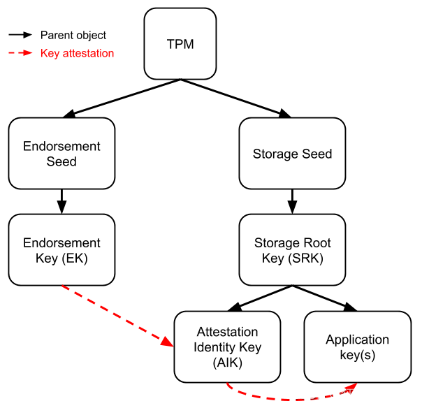

# 3. TPM keys

A Trusted Platform Module (TPM) is a specialized chip on an endpoint device that stores RSA encryption keys specific to the host system for hardware authentication. The TPM technology is designed to provide hardware-based, security-related functions.

### How TPM internally works (based on cryptographic keys)

As a TPM can securely generate encryption keys, it has the following architecture -

SEED - This is usually setted-up by the manufacturer, which plays a vital role in generating the primary/private key data inside the KDF (key derivation function) which also adds additional entropy to the KDF.

By using the same user entropy added to the internal seed we can know who generated the same primary key.&#x20;

PRIMARY KEY -&#x20;

* Primary Keys are generated by the TPM and never leave the TPM. They are used to protect (encrypt) child keys.&#x20;
* The Primary Key is at the root of the TPM's storage hierarchy. It's created when you take ownership of the TPM and it is protected by the **Storage Root Key (SEED)**, which is burned into the TPM at manufacture time.
* The private portion of a primary key, also called an endorsement key, is never exposed to any other component, software, process, or user.
* As the private material of private keys never leave the TPM, we can only regenerate them.\
  We can also persist a TPM key to aviod the regeneration of the keys.
* _We don't associate primary key in usual operations._&#x20;
* Primary keys are always asymmetric - ECC or RSA.
* &#x20;Usually, primary keys do not support signing, it is possible, however it is meant to wrap the child key by default. (which in this case proves [Endorsement keys](3.-tpm-keys.md#tpm-key-hierarchies) does not have the capability to generate signatures)
*

CHILD KEYS -&#x20;

* Child keys can leave the TPM if they are encrypted by a parent key (also known as wrapping). This means that the child key is protected by the parent key.&#x20;
* A child key is a key that is created by a TPM and wrapped (encrypted) by its parent key.&#x20;
* A child key can be used for various purposes, such as signing, encryption, or storage.&#x20;
* A child key can also become a parent key if it meets certain conditions, such as being a storage key.&#x20;
* A child key can only be unwrapped (decrypted) by its parent key.
* _Child keys are the one that we usually associate with different operations._
* They can be symmetric or key-hash as well like AES128

> Here is an example to make it clearer:
>
> Let's say you have a safe (the TPM) and inside that safe, you have a locked box (primary key). Inside this locked box, you place another smaller locked box (child key). The smaller box can be taken out of the safe, but it can't be opened because it's protected by the lock from the bigger box (encrypted by the parent key). The big box can't be taken out of the safe (never leaves the TPM).
>
> So, the big box (primary key) protects the smaller box (child key), and the safe (TPM) protects the big box. This process ensures a secure way of handling keys, where even if the child key is somehow exposed, it can't be used because it's encrypted by the primary key.

The TPM can create a hierarchy of keys, where each level of keys is protected by the level above it. This provides security and flexibility for key management. For example, a primary key can be used to create a storage key, which can be used to create signing keys, which can be used to sign data or certificates. The TPM can also seal and unseal keys based on the state of the system, ensuring that the keys are only accessible when the system is trustworthy.

### TPM key hierarchies -

<figure><figcaption></figcaption></figure>

The Trusted Platform Module (TPM) uses a hierarchical structure to manage and utilize the keys securely. There are three main hierarchies in a TPM:

1. **Storage Hierarchy (SH)**: This hierarchy is the most commonly used and includes the storage root key (SRK), which is created when a TPM is first initialized. This SRK is a primary key and is used to protect (encrypt) other keys in the TPM.
2. **Endorsement Hierarchy (EH)**: This hierarchy is primarily intended for privacy-sensitive operations. The root of the endorsement hierarchy is the endorsement key (EK), which is typically embedded into the TPM by the manufacturer. This key is used to prove the authenticity of the TPM.
3. **Platform Hierarchy (PH)**: This hierarchy is typically managed by the platform firmware and is intended to isolate keys used by platform firmware from those used by the OS or applications.
4. **NULL Hierarchy**: This is another hierarchy, where Random seeds are generated on every power cycle. (Its seed is never the same, seeded every power cycle)\
   This is used to generate **one time keys.**

_**NOTE:** There can be unlimited number of user hierarchies_

> **Platform** - Objects by the OEM (Original equipment manufacturer)
>
> **Endorsement -** Objects by the TPM vendor
>
> **Owner -** User owned TPM objects are created there
>
> **NULL -**  Random seed at every power-up cycle

Now, let's take a practical example to understand this better:

> Imagine your TPM as a building with three separate sections or wings (the hierarchies).
>
> The Storage Hierarchy (SH) is like the main section where most people work (most commonly used). It's protected by a master key (SRK) - think of this as the main security system that protects all the individual offices (other keys) inside.\
> \
> The Endorsement Hierarchy (EH) is like a special wing where sensitive work takes place. The endorsement key (EK) is like a special ID badge proving the building is legitimate and trustworthy.\
> \
> The Platform Hierarchy (PH) is like the maintenance wing, where the building's essential systems like heating or electricity are managed (platform firmware). This section is kept separate from the main working area (isolated from OS or applications).

This way, the hierarchies in TPM help in securing and managing the keys effectively.

### Supported KEY types -

* **Asymmetric**
  * RSA
  * ECC
* **Symmetric (export restrictions)**
  * AES/SM4
* **Keyed Hash**
  * HMAC
  * XOR

